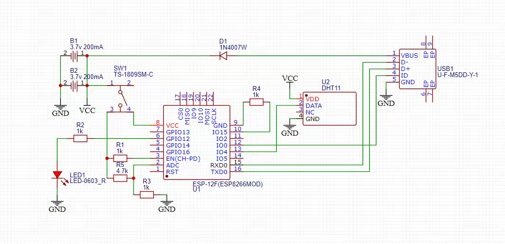

# nafuture-zxn1-resources

Resources for Nafuture ZhiXi-N1

English | [简体中文](./README.zh-CN.md)

## Introduction

The Nafuture Zhixi-N1 is a low cost temperature and humidity sensor produced by [Nafuture](http://www.nafuture.cn/) (discontinued). It feafures an ESP-12F module (ESP8266), a DHT11 temerature sensor and **2** 200mAh LiPo batteries. It has a micro-USB port that you can use to charge the batteries and re-program the ESP-12F module with a custom UART programmer.

You can get one from Taobao for only 4.9 CNY.


## On-Board Components

- 1 X ESP-12F (with an LED)
- 1 x DHT11
- 2 x 200mAh LiPo batteries
- 1 additional LED
- 1 x push switch

## ESP-12F Pin References

|   Pin   |          Connected to          |
|:-------:|:------------------------------:|
|  GPIO12 |            Main LED            |
|  GPIO4  |              DHT11             |
|  GPIO2  |           ESP-12F LED          |
|   ADC   |  VCC through a voltage divider |
|   TXD0  |          Micro-USB D+          |
|   RXD0  |          Micro-USB D-          |
|  GPIO0  |          Micro-USB ID          |

## PCB Schematic



## Measure VCC (battery) Voltage

Part of the circuit:

```
            ___ VCC
             |
+-----+    <4.7K>
| ... |      |
| ADC |------+
| ... |      |
+-----+    <1K>
            _|_ 
               GND

```

Since the ESP8266's ADC is 10-bit (0-1023) from 0 to 1V, the voltage can be calculated based from the ADC reading as follows:

```
voltage = ADC_reading / 1024 / 10 * 57
```

## How to Update the Firmware of ZXN1 with [the Programmer](https://market.m.taobao.com/app/idleFish-F2e/widle-taobao-rax/page-detail?wh_weex=true&wx_navbar_transparent=true&id=626032002165&ut_sk=1.X23p8dbHZsEDAI2wCPftXkIY_21407387_1601553035380.Copy.detail.626032002165.3586168982&forceFlush=1) (or you can make a programmer yourself using a micro-USB breakout board and a common USB-UART programmer)

- Connect the programmer to your computer and your ZXN1
- Run the firmware flashing program on your computer (esptool)
- Press the `flash` key on the programmer, while it's being pressed, start (or restart) your ZXN1
- Wait for the flashing to finish

## MicroPython Sample Code

The MicroPython code in this repository simply does a one time measurement of the temperature, humidity and battery voltage on start, and put the values into a string which is broadcasted as a WiFi SSID. You can then check the values from your phone's WiFi settings: (Nothing will happen if you connect to the AP)


See [./upython](./upython)

### How to Use

- Install [Thonny IDE](https://thonny.org/) (recommended)
- Download the latest micropython firmware (currently V1.13) for ESP8266 from <https://micropython.org/download/>
- Upload the firmware to your ZXN1 through Thonny (or esptool if you know how to use it)
- Upload `battery.py`, `sensor.py`, `main.py` to your ZXN1 using Thonny
- Restart your ZXN1 to run the code

## Stock Firmware

see `firmware` dirctory

## Where to Buy

- [Taobao link for the Nafuture ZhiXi-N1](https://m.tb.cn/h.Vzupfv7?sm=34d8ae)
- [Xianyu link for the programmer](https://market.m.taobao.com/app/idleFish-F2e/widle-taobao-rax/page-detail?wh_weex=true&wx_navbar_transparent=true&id=626032002165&ut_sk=1.X23p8dbHZsEDAI2wCPftXkIY_21407387_1601553035380.Copy.detail.626032002165.3586168982&forceFlush=1)
